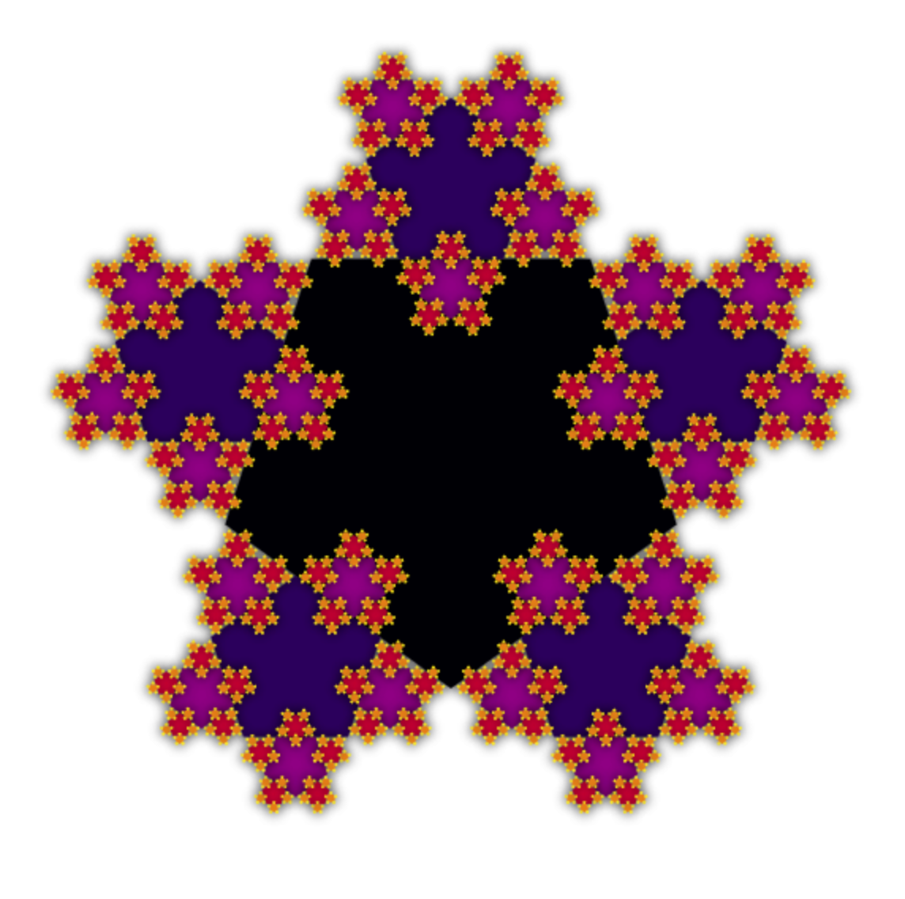

## Functional bindings for the HTML Canvas API

**Inspired by**

- [purescript-canvas](https://github.com/purescript-contrib/purescript-canvas)
- [purescript-free-canvas](https://github.com/paf31/purescript-free-canvas)
- [purescript-drawing](https://github.com/purescript-contrib/purescript-drawing)

# Installation

To install the stable version:

```
npm install graphics-ts fp-ts
```

Note: `fp-ts` is a peer dependency for `graphics-ts`

# Documentation

- [API Reference](https://gcanti.github.io/graphics-ts/docs/modules)

## Example

To run the example, clone the repository and run the following:

```
npm install
npm start
open example/test.html
```



Adapted from https://github.com/purescript-contrib/purescript-drawing/blob/master/test/Main.purs
